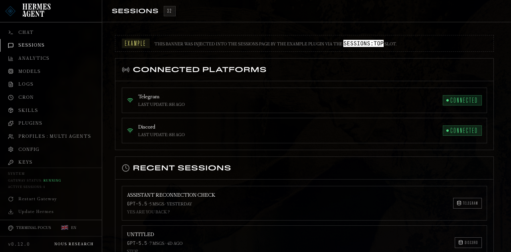
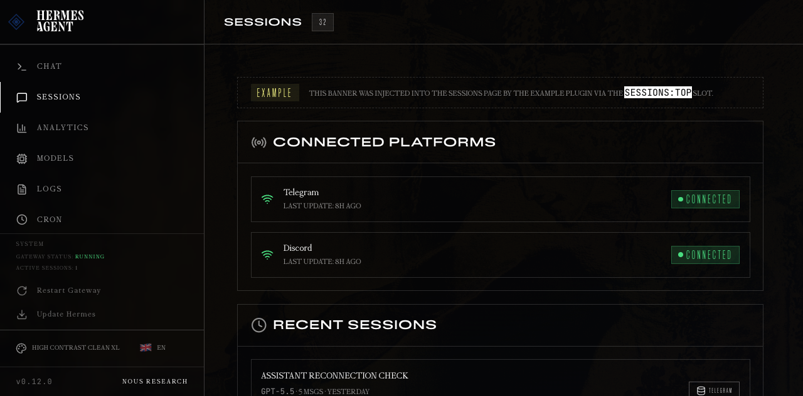
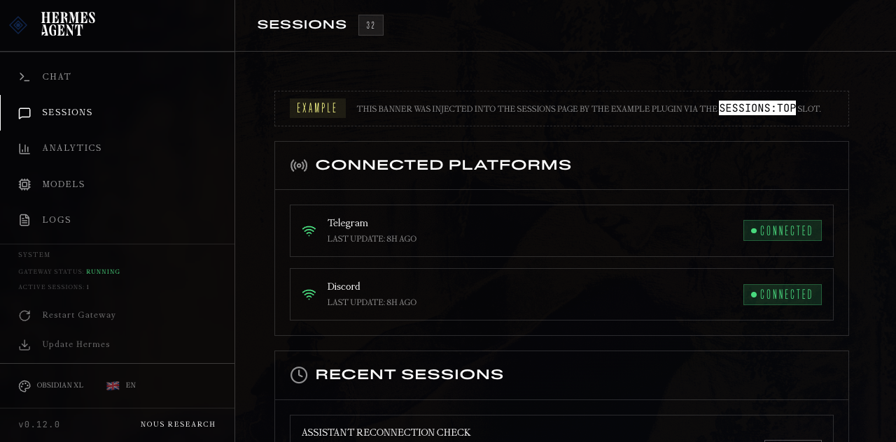
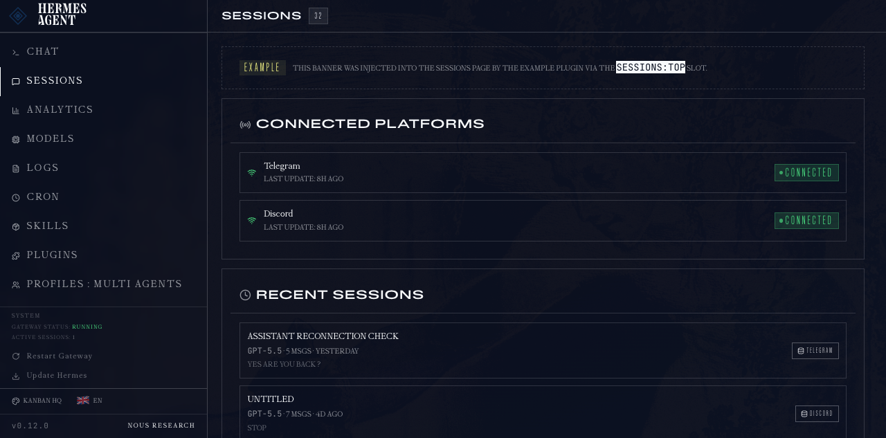

# Yak's Hermes Dashboard Themes

A small pack of readable, low-noise custom themes for the Hermes Agent web dashboard.

These themes are designed for long dashboard sessions: strong contrast, normal letter spacing, readable fonts, reduced glow/noise, and layout tweaks for larger controls or Kanban-focused workflows.

## Included themes

### Terminal Focus

Black technical focus mode with enlarged code/log readability and minimal decoration.



### High Contrast Clean XL

Accessibility-first black/charcoal theme with larger controls and text.



### Obsidian XL

Large dark command layout with bigger targets and comfortable spacing.



### Kanban HQ

Task-board-first dark theme with compact columns, readable cards, and strong status colors.



## Install

Copy the YAML files into your Hermes dashboard themes directory:

```bash
mkdir -p ~/.hermes/dashboard-themes
cp themes/*.yaml ~/.hermes/dashboard-themes/
```

Then restart or refresh the Hermes dashboard.

If your dashboard is running locally:

```bash
hermes dashboard --host 127.0.0.1 --port 9119 --tui --no-open
```

Open:

```txt
http://127.0.0.1:9119
```

Click **Switch theme** and select one of the themes.

## One-command install from a cloned repo

```bash
./scripts/install.sh
```

## Notes

- These are user-local Hermes themes. They do not overwrite built-in dashboard themes.
- Theme files are discovered from `~/.hermes/dashboard-themes/*.yaml`.
- Active theme is stored in Hermes config under `dashboard.theme`.
- If the theme picker has many themes and is hard to scroll, update Hermes or patch the dashboard theme selector to use a capped-height scroll container.

## License

MIT
